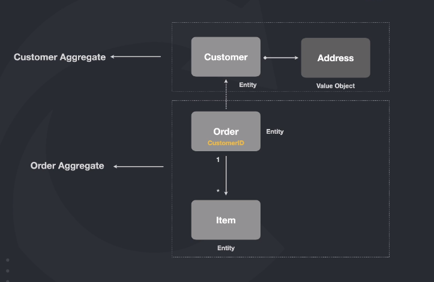

## Entidades
Entidades no ddd não tem nada a ver com entidades de ORM. Aqui uma entidade é um objeto unico  e identificavel no sistema
onde esta suas regras de negocio.
Uma entidade sempre tem que ter seu valor consistente isso que dizer que quando a criamos seu valores precisam estar
consistentes e não depois que criar ir mudando os atributos.
Uma entidade por padrão sempre vai fazer sua auto validação.Ele sempre ter que manter seu estado consistente.
Eu posso ter outra classe para utilizar como ORM.

Geralmente temos a seguinte estrutura no projeto:
entity = onde esta a nossa regra de negocio.
infra/entity ou model = onde esta nossa classe de ORM.

A entity resolve uma complexidade de negocio.
A entity de ORM resolver uma complexidade externo com o Banco de dados.

## Value Objects
É um conjunto de propriedades imutavel que não contem Id.Por exemplo, um CPF não é apenas uma String é um objeto que contem uam regra para ser 
construida com um numero exato de caracteres , validações  e outras coisas.
Igual a entidade seus dados sempre precisão estar coesos na sua criação.
Podemos considerar como classes que vão nos auxilixar para guardar informações adicionais relacionadas a uma entidade.

## Agregate
São entidade/value objects que existem por causa de outras entidade ou tem suas dependencias.
Sempre que temos um relacionamento com outros objetos podemos falar que são uns agregados  a diferença aqui é seu grau de associação:

O item de uma ordem tem uma forte acoplamento porque a ordem não existe sem itens e um item
não existe sem uma ordem.

Sua relação com um customer tem um acoplamento fraco, porque um customer pode existir sem uma ordem mas um ordem precisa ter um customer , mas não precisamos colocar a entidade completa podemos colocar apenas o seu id. Isso porque ela faz parte de outro contexto de agragado.

Todo agregado tem um Root então por convenção o agregado precisa começar com o numere de sua root.
No exemplo da imagem o nome correto é OrderItem.

## Repository

## Referencia
https://plataforma.fullcycle.com.br/courses/3b8c4f2c-aff9-4399-a72a-ad879e5689a2/274/168/167/conteudos?capitulo=167&conteudo=7658
https://github.com/ddd-crew